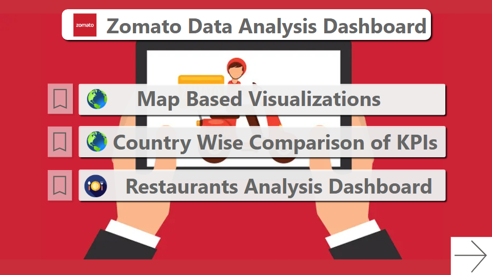
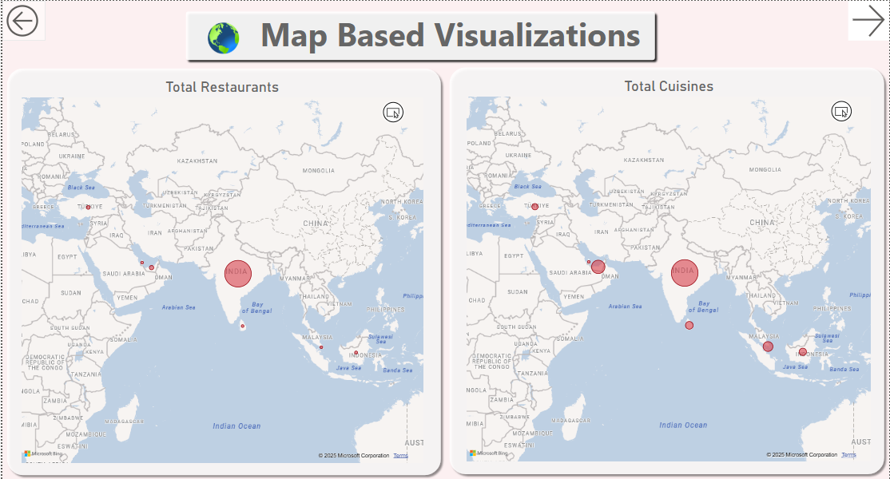
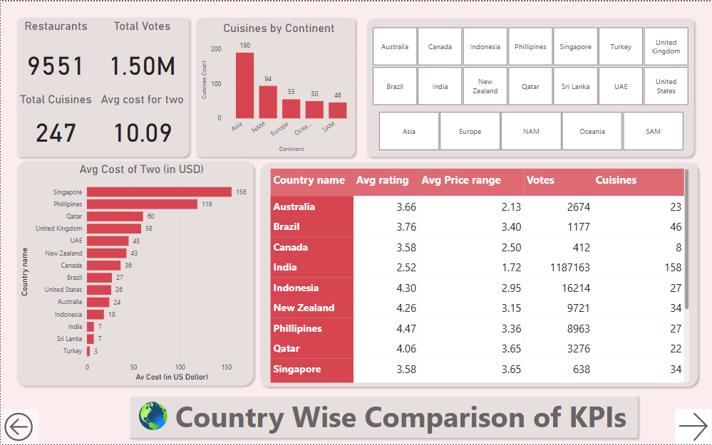
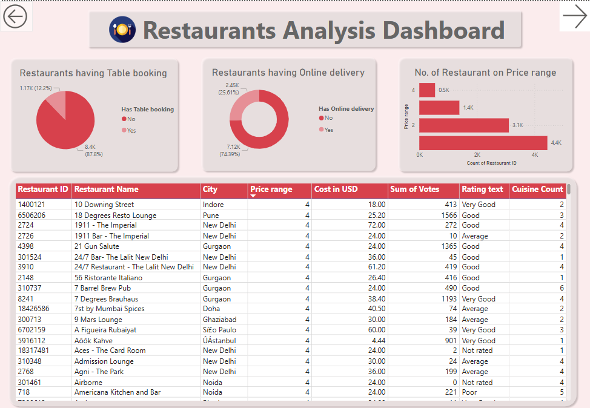

# Zomato Data Analysis Dashboard

---

This repository contains a Power BI dashboard for analyzing Zomato restaurant data. The dashboard provides insights into restaurant distribution, country-wise comparisons, and detailed restaurant analysis.

## Dashboard Overview

The Zomato Data Analysis Dashboard consists of three main sections:

1. Map Based Visualizations
2. Country Wise Comparison of KPIs
3. Restaurants Analysis Dashboard

## Screenshots

### 1. Dashboard Home

### 2. Map Based Visualizations

### 3. Country Wise Comparison of KPIs

### 4. Restaurants Analysis Dashboard

## Key Features

- Geographical distribution of restaurants and cuisines
- Country-wise comparison of key performance indicators
- Detailed restaurant analysis including table booking and online delivery stats
- Price range distribution of restaurants
- Comprehensive restaurant data table

## Key Insights

- Total Restaurants: 9,551
- Total Votes: 1.50M
- Total Cuisines: 247
- Average Cost for Two: $10.09
- Only 12.2% of restaurants offer table booking
- 74.39% of restaurants provide online delivery
- Asia has the highest number of cuisines available
- India has the highest number of user votes

## How to Use

1. Clone this repository
2. Open the .pbix file with Power BI Desktop
3. Refresh the data if needed
4. Interact with the dashboard to explore insights

## Data Source

The data used in this dashboard is sourced from Zomato. Please refer to Zomato's terms of use for data usage guidelines.

## Created On

This dashboard was created on February 16, 2025.

## Contributing

Feel free to fork this repository and submit pull requests for any enhancements.
